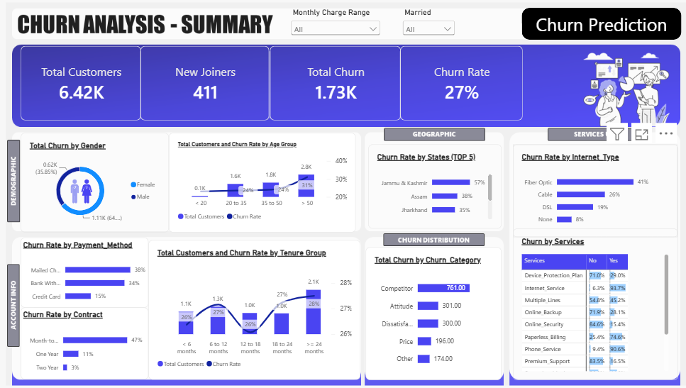
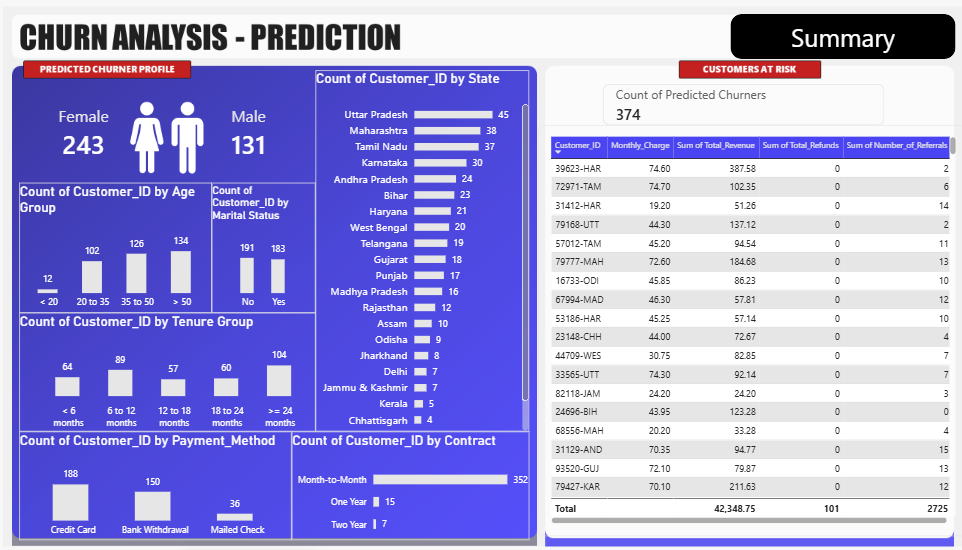

# Telecom Customer Churn: SQL, Power BI and Churn Prediction

I wanted to understand why telecom customers leave, and see if I could spot the new customers most likely to leave next. This project goes from a raw CSV to a cleaned SQL database, a Power BI dashboard, and a Random Forest model that scores the newest customers.

**Tools:** SQL, Power BI, Python, Excel, Jupyter

## The questions

1. Who is churning, and what do they have in common?
2. Why are they leaving?
3. Which of the 411 new joiners look most likely to churn?

## The data

`Customer_Data.csv` has 6,418 customers and 32 columns: demographics (age, gender, state, marital status), account details (tenure, contract, payment method, charges, referrals), services (internet type, streaming, online security and so on) and a status column.

| Status | Customers |
|---|---|
| Stayed | 4,275 |
| Churned | 1,732 |
| Joined (new, outcome unknown) | 411 |

Customers who churned also have a churn category and a churn reason.

## Step 1: SQL (in the `sql/` folder)

I loaded the raw file into a staging table, `stg_Churn`, in a database called `db_Churn`, then worked through four scripts:

| Script | What it does |
|---|---|
| `1_DataExp.sql` | Checks the spread of gender, contract, state and customer status, including how much revenue each status brings in |
| `2_CheckNULLs.sql` | Counts missing values in every column |
| `3_CleanData.sql` | Fills the missing values and saves the result to a clean table, `prod_Churn` |
| `4_NewViews.sql` | Creates the two views used by Power BI and Python |

What I found in the null check: 13 columns had missing values. The internet add-on columns (online security, backup, streaming and so on) were each missing for 1,390 customers, which matches the 1,390 customers with no internet type, so these are customers who don't have internet service and not random gaps. `Value_Deal` was missing for 3,548 customers and `Multiple_Lines` for 622. Churn category and reason were missing for the 4,686 customers who didn't churn.

How I filled them: `Value_Deal` and `Internet_Type` became `'None'`, the service add-ons and `Multiple_Lines` became `'No'`, and churn category and reason became `'Others'`.

The two views:
- `vw_ChurnData`: customers who stayed or churned (6,007 rows), used for the dashboard and for training
- `vw_JoinData`: the 411 new joiners, used for prediction

About 17.5% of all revenue (3.4 million out of 19.5 million) came from customers who later churned.

## Step 2: Power BI dashboard

Two pages: one for the churn analysis and one for the predicted churners.



- **Churn rate is 27%.** 1,732 of 6,418 customers left. If you leave out the 411 new joiners (we don't know their outcome yet), it is 28.8%.
- **Contract type matters most.** Month-to-month customers churn at 46.5%, one-year at 11.0% and two-year at only 2.7%.
- **Fiber optic customers leave more.** 41.1% churn, compared with 25.7% for cable and 19.4% for DSL.
- **Payment method:** mailed check (37.8%) and bank withdrawal (34.4%) churn far more than credit card (14.8%).
- **Competitors are the main reason.** 761 of the 1,732 churned customers (44%) left for a competitor. The biggest single reasons were competitors with better devices (289) and better offers (274), then the attitude of support staff (208).


## Step 3: The model (Python)

I exported the two views to Excel (`Prediction_Data.xlsx`, one sheet per view) and read the `vw_ChurnData` sheet in Python. I dropped the customer ID and the churn category and reason columns (these only exist for people who already left, so they would give away the answer), filled missing values, and label-encoded the text columns. Then I trained a Random Forest (100 trees, `random_state=42`) on a stratified 80/20 split: 4,805 customers for training and 1,202 for testing.

| | Precision | Recall | F1 |
|---|---|---|---|
| Stayed | 0.87 | 0.93 | 0.90 |
| Churned | 0.80 | 0.65 | 0.72 |

Overall accuracy was 85%. The confusion matrix on the test set:

| | Predicted stayed | Predicted churned |
|---|---|---|
| **Actually stayed** | 798 | 57 |
| **Actually churned** | 121 | 226 |

So the model catches about 65% of the customers who really churn, and when it says someone will churn it is right about 80% of the time.

The most important features were contract type, total revenue, total charges, monthly charge and total long-distance charges, followed by age and tenure.

## Step 4: Predictions for new joiners

I ran the model on the `vw_JoinData` sheet and saved the flagged customers to `OutPut_Data.xlsx`, which feeds the second dashboard page.



The model flagged **374 of the 411 new joiners** as likely churners. Of those, 243 are female and 131 are male, 352 are on month-to-month contracts, and the states with the most flagged customers are Uttar Pradesh (45), Maharashtra (38) and Tamil Nadu (37). Together they bring in 42,348.75 in total revenue.

## Things to be careful about

- **374 out of 411 is 91%, which is a lot.** Historically about 29% of customers churn. One reason is that 367 of the 411 joiners (89%) are on month-to-month contracts, the group that churns most. I used the model's yes/no prediction, not probabilities, so I would read the list as "higher risk" and not as 374 certain churners.
- **Recall for churners is 65%,** so the model misses about a third of the people who really leave.
- **Some data is messy.** 107 rows have a negative monthly charge. I left them in and did not investigate them.
- **This shows patterns, not causes.** For example, long contracts might lock people in, so a low churn rate there does not prove the contract itself keeps them.
- **pandas reads the text `'None'` as a missing value,** so the notebook fills those cells with `'None'` again before encoding.
- **Label encoding** is fine for a Random Forest, but it would not be a good choice for a linear model.
- `Total_Revenue` and `Total_Charges` grow with tenure, so they partly overlap with it.

## What I would do next

- Switch to `predict_proba` and pick a threshold so the list is ranked by risk.
- Try class weights or a different threshold to push recall up for churners.
- Look into the negative monthly charges.
- Compare the Random Forest against logistic regression and gradient boosting.

## Files

```
├── README.md
├── Telecom_2.ipynb            Python notebook (model and predictions)
├── Telecom_2.pbix             Power BI dashboard
├── data/
│   ├── Customer_Data.csv      raw data
│   ├── Prediction_Data.xlsx   sheets: vw_ChurnData, vw_JoinData
│   └── OutPut_Data.xlsx       the 374 predicted churners
├── images/                    dashboard screenshots
└── sql/
    ├── 1_DataExp.sql
    ├── 2_CheckNULLs.sql
    ├── 3_CleanData.sql
    └── 4_NewViews.sql
```

## How to run it

1. Download the files and install `pandas`, `numpy`, `scikit-learn`, `matplotlib`, `seaborn`, `openpyxl` and `jupyter`.
2. In `Telecom_2.ipynb`, set `file_path` to wherever you saved `Prediction_Data.xlsx` (for example `data/Prediction_Data.xlsx`).
3. Run the cells once, from top to bottom. Running the data-processing cell twice breaks the label encoders, so restart the kernel if you need to start over.
4. Open `Telecom_2.pbix` in Power BI Desktop to see the dashboards.
5. To rebuild the database, load `Customer_Data.csv` into a table called `stg_Churn` in SQL Server and run the four scripts in order.
